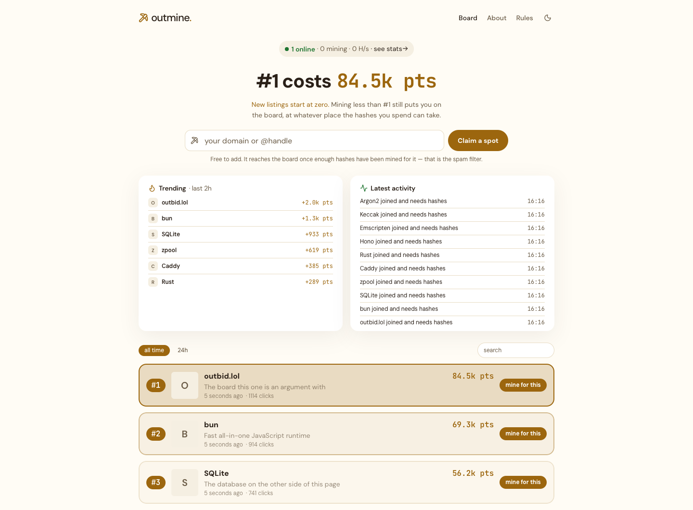

<div align="center">

# outmine

**A leaderboard you cannot buy. Rank is paid in CPU time.**

[](LICENSE)
[](https://github.com/BlvckParrot/outmine/actions/workflows/image.yml)
[](https://bun.sh)



</div>

Same shape as [outbid.lol](https://outbid.lol) — one board, listings competing for the top
slot — except the currency is browser mining, and the proceeds go to whoever runs the site.

No accounts. A visitor picks a listing and mines for it, exactly as an outbid.lol visitor
pays for someone's position. That also kills sybil farming on its own: fifty tabs means
fifty times the real work.

## How it works

- **Claim a spot.** Any domain or `@handle`. Free, no sign-up.
- **Mine for it.** The browser hashes in a WebAssembly worker while the tab is open.
- **Shares are the score.** Every share the pool accepts moves that listing up the board.

A new listing does not reach the board until enough shares have been mined for it. That is
the entire spam filter: a spammer pays in the same currency everyone else competes in.
Until then it sits in "waiting for hashes" with a progress bar — a gate that hid listings
from the very people who would mine them onto the board would be a wall.

## Nothing mines unless you ask

A banner is the first thing on the page, and it says what this is in one line: this site
mines cryptocurrency with your CPU, the proceeds go to the site owner, it will use battery.

Accepting it is not the same as starting. **A stored consent still does not start the CPU.**
A returning visitor is not asked twice, but they still press a button before a single hash
is computed — `scripts/browser-check.ts` reloads with consent already stored and fails if
anything is mining afterwards.

While it runs there is a thread count and a throttle, both movable mid-run, and a stop
button. Mining only happens while the tab is open.

Visitors are counted with one message on the socket that is already open — no cookies, no
third-party scripts, no pixel. Referrers are kept as hosts, never full URLs.

## The score cannot be faked

The browser never reports its own score. It finds nonces; the server submits them to the
pool; a share counts only once **the pool accepts it**. A forged nonce is rejected upstream,
so there is nothing to fake and no heuristic to tune.

Verified end to end in `packages/server/src/hub.integration.test.ts`: five random nonces
produce five rejections and zero score.

## What it earns

Algorithm choice moves revenue by orders of magnitude; nothing else comes close. Measured
on an Apple M-series, one WASM thread, with `bun run bench`:

| | H/s in a browser | zpool's advertised rate |
|---|---|---|
| minotaurx | 896 | 0.00013543 /MH/day |
| **rinhash** | **14,025** | **0.00485204 /MH/day** |

**The hashrate column is measured. The rate column is not.** RinHash runs 15.6x faster in a
browser because its Argon2d touches 64 KiB where yespower touches 2 MiB — that much is ours
to verify, and on its own it is reason enough to prefer it. The rate is zpool's own
advertisement and it does not survive a sanity check: 0.00485 BTC per MH/s per day is $372 a
day for one megahash, which would have every CPU on earth pointed at this coin by tomorrow.
The pool has fifty miners on it.

What *is* measured end to end, by watching the payout address across a run: MinotaurX at
3.1 kH/s for three minutes credited 9.5e-11 BTC — a tenth of what that table predicts.
`scripts/measure-yield.ts` settles it properly, mining for a couple of hours and dividing
the credited BTC by the hashes that earned it. Run it before believing any ratio, this one
included.

Browser mining pays little either way; that is the honest baseline. The leaderboard is what
makes any of it worth anything — a normal page gets a 30-second visit, a board people
compete on gets a tab left open for hours.

## Run it

```bash
git clone --recurse-submodules https://github.com/BlvckParrot/outmine.git
cd outmine
cp .env.example .env   # set POOL_USER to your payout address
bun install
bun run build          # WASM then frontend, in dependency order
bun start
```

The miner's upstream C is two submodules, so a clone without `--recurse-submodules` needs
`git submodule update --init --filter=blob:none` first. Building the WASM itself needs
emscripten (`brew install emscripten`).

```bash
bun run dev            # API and Vite together, on :5173
bun run check          # typecheck and tests
```

Development is cross-origin, so `.env` needs `ALLOWED_ORIGINS=http://localhost:5173`.

## Deploy

One small VPS is the whole shape of it: one Bun process, one SQLite file, Caddy in front
for TLS. The image is built by CI and pushed to GHCR, so the host only ever pulls.

```bash
sudo chown -R 1000:1000 ./data ./backups   # once, before the first start
docker compose pull && docker compose up -d
curl -s https://your-domain/health         # poolHealthy:false means outbound 7444 is blocked
```

Four things are worth knowing. Every other setting is documented, one commented paragraph
each, in [.env.example](.env.example).

- **`POOL_USER` is required.** The server refuses to start without it — mining to an empty
  address credits nobody, and nothing else would complain.
- **`ALLOWED_ORIGINS` is a security control, not a convenience.** The mining socket accepts
  any browser that reaches it, so without an origin policy another site can run
  `new WebSocket("wss://your-host/ws")` and mine on *its* visitors' CPUs against your pool
  account, skipping the consent banner entirely.
- **Back up on a schedule.** `scripts/backup.ts` uses `VACUUM INTO`, which snapshots
  consistently without stopping writers, into a separate mount:
  ```
  0 4 * * *  cd /srv/outmine && docker compose exec -T app bun scripts/backup.ts
  ```
- **`ADMIN_TOKEN`** enables `DELETE /api/listings/:id`, the only way to take a listing down
  short of editing SQLite by hand.

## Licence

[GPL-2.0](LICENSE), for the whole repository.

Not a preference. The miner is compiled from cpuminer-multi and cpuminer-opt-rin, and the
latter states plain version 2 with no "or later" clause, which fixes the licence for
everything built with it. Both are submodules under `packages/wasm/vendor`, pinned by
commit, so the corresponding source of any shipped `mine-*.wasm` is whatever
`git submodule status` names. Argon2's portable `ref.c` is vendored separately, with
[its provenance beside it](packages/wasm/argon2-ref/README.md). The bundled DM Sans and
JetBrains Mono are under the SIL Open Font License.
